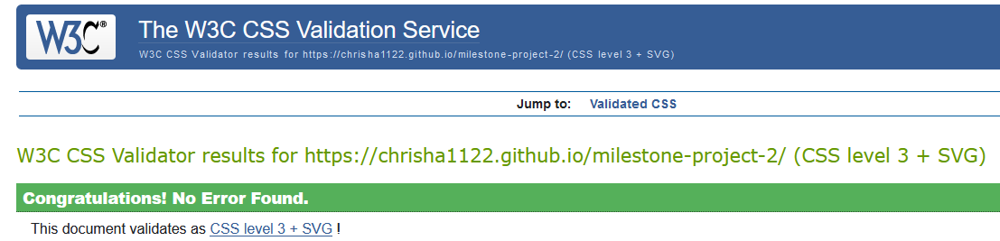

# Snake Game Website

[View the live site here](https://chrisha1122.github.io/milestone-project-2/)

This website was designed to be a fun game for all ages. The game is inspired by the snake game from the old nokia phones.

## Table of Contents

- [**Project Goals**](#project-goals)
- [**User Experience UX**](#user-experience-ux)
- [**Wireframes**](#wireframes)
- [**Features**](#features)
- [**Technologies**](#technologies)
- [**Testing**](#testing)
- [**Installation**](#installation)
- [**Deployment**](#deployment)
- [**Credits**](#credits)
- [**Acknowledgements**](#acknowledgements)

## Project Goals

The main aim is to give users a fun experience playing an old style game.

The target audience is anyone who enjoys playing games.

### User goals

* A game for a player of any age. 
* Enjoyable experiance on the site.
* Have fun playing the game.
* Keep playing to try get better score.
* Create a username and have it saved.
* An easy to play game.

### Developer goals

* Create a clean responsive interactive website for milestone project.
* Make game easy to play.
* An easy to navigate site. 
* A project that would be good enough to go in a portfolio.
* Have fun learning to build a game.

## User Experience - UX

### Design Choices

#### Fonts

* The font Arcadepix was taken from [Dafont](https://www.dafont.com/) using font-face.
* The font Arcadepix was chosen because of the argade/game effect it has.
* The default sans-serif is used for backup font.

#### Colours

* I used basic colours for the game as its based on old style gaming.
* The primary colour choices of black and a timberwolf were chosen because they have a clean clear aspect while contrasting well with each other.
* The colour pakistan green was used for the snake and food.
* All colours were chosen to stand out against the background.

#### Styling

* [Phaser3](https://phaser.io/) was used throughout the project for its built in game building capabilities.
* Basic home page for easy navigation.
* Plain colours for the old game look.

#### Images

* Images were taken from [Phaser3 Examples](https://github.com/photonstorm/phaser3-examples) and were used for the snake body and food.
* All images used credited in the credits section.

## Wireframes

Wireframes for the project were developed after the idea was scribbled on a piece of paper, the program used being Figma.

### Homepage Wireframe

### Gamepage Wireframe

## Features

The Snake game website is designed to strictly adhere to accessibility guidelines across all pages, with easy navigation between homepage and game. Device responsiveness approach taken throughout project. The game can be played onboth desktop and mobile due to arrow and touchscreen controls.

### Homepage

* The main background image is a screenshot of the game.
* The font arcadepix was used to give it a game look.
* A button was used to link to the game page.
* Add username option for players, username saved and displayed on the gameover pop up.

### Gamepage

* Two images were chosen for the snake and food, credit given in the credits section.
* Directions controls added for player movement of snake.
* Add body function everytime snake consumes food a body piece is added.
* Add food function everytime food is consumed new food is placed on game canvas.
* A score function that gives 10 points everytime food is consumed.
* A pause feature so player can pause game when needed.
* Move function added using Math.Wrap so the snake goes off one side of the screen and reappears on the other side.
* A speed up function everytime snake consumes 5 food snake speeds up for increased difficulty.
* A gameover/restart function when snake collides with its self game can be restarted.

## Technologies

### Languages

This project was built using [HTML5](https://en.wikipedia.org/wiki/HTML5),[CSS3](https://en.wikipedia.org/wiki/CSS) and [JS](https://www.javascript.com/) using a link from [Phaser3](https://phaser.io/).

### Frameworks

Here is a list of the following technologies used in this project:

- [HTML5](https://en.wikipedia.org/wiki/HTML5)
HTML 5 was used to create the structure of the website.
- [CSS3](https://en.wikipedia.org/wiki/CSS)
CSS 3 was used to style the website.
- [JS](https://www.javascript.com/)
JS was used to give interactivity.
- [Phaser3](https://phaser.io/)
Phaser was used for its built in game mechanics.
- [GitHub](https://github.com/)
GitHub was used to store the projects code.
- [Gitpod](https://gitpod.io/)
Gitpod terminal was used to commit my code using Git and push it to Github.
- [Figma](https://www.figma.com/templates/wireframe-kits/)
Figma was used to design the wireframes for the project.
- [Am I Responsive](https://ui.dev/amiresponsive)
Am I responsive was used to ensure the website is responsive on all devices.
- [W3C Validation](https://validator.w3.org/)
W3C Validation was uesd for checking HTML and CSS for mistakes.
- [ES6 Validator](https://www.piliapp.com/syntax-check/es6/)
W3C Validation was uesd for checking HTML and CSS for mistakes.

## Testing

### Browsers

Developer tools on Firefox and Google Chrome were used throughout the project.
The website was tested on three different browsers with no problems:

* Microsoft Edge
* Google Chrome
* Mozila Firefox

### Mobile

Developer tools on Firefox and Google Chrome were used throughout the project to check site responsiveness.
Checked the website on my own mobile and other family members, just need to implement touch screen feature for game on mobile in future update.

* Iphone
* Samsung Galaxy
* Dev Tools Mobile Responsiveness

### HTML Validator

HTML Validator using [W3C Validation](https://validator.w3.org/) confirms no errors or warnings.

### CSS Validator

CSS Validator using [W3C Validation](https://jigsaw.w3.org/css-validator/) confirms no errors found.

### JS Validator

JS Validator using [ES6 Syntax Check](https://www.piliapp.com/syntax-check/es6/) confirms no errors found.

### Bugs

* Game link button on home page showing error in html validator:
FIX - Changed to class btn.

* 404 error showing on gmaepage when site went live:
FIX - Adjusted file path.

* Game pause when any part of screen is clicked:
FIX - Changed pause text to set.Interactive.

### Future Updates

* Add a Highscore page to showcase scores from different players.
* Add more levels with increased difficulty.

## Installation

To clone this project into Github you will need:

1. A Github account.
2. Install the Gitpod extension.
3. Log into Gitpod with your Github account.
4. On the GitHub website find and click on the [Github repository](https://github.com/CHRISHA1122/milestone-project-2) of intrest.
5. Locate the green button named Gitpod in the top right corner of the repository and click on it,
6. This will trigger a new Gitpod workspace to be created from the code in Github where you can work locally.

## Deployment

This project was developed using Gitpod, commited to Git and pushed to Github using it's built in console function.

* git status - Gives status of repository.
* git add - Adds files to staging area.
* git commit -m "First commit" - Commits files to repository.
* git push - Sends commited files to remote repository.

To deploy this page to Github pages from its [Github repository](https://github.com/CHRISHA1122/milestone-project-2),
the following steps were taken:

1. Log into Github.
2. From the list of repositorieson the screen select [CHRISHA1122/milestone-project-2](CHRISHA1122/milestone-project-2)
3. On the menu item go to Settings.
4. Scroll down and select Pages.
5. Under "Source" click the drop-down menu labelled "None" and select "Main".
6. Upon selection, the page will automatically refresh meaning that the website is now deployed.
7. Scroll back down to the "Pages" section to retrieve the deployed link.

## Credits

### Code

* [Code Institute](https://codeinstitute.net) what i've learned from the learning material.
* [Phaser3 Examples](https://github.com/photonstorm/phaser3-examples) for its game functionality.
* [W3Schools](https://www.w3schools.com/) any trouble shooting.
* [Webtips.dev](https://www.webtips.dev/) any trouble shooting.

### Images

* Images used for body of snake and food taken from [Phaser3 Examples](https://github.com/photonstorm/phaser3-examples).

## Acknowledgements

* I would like to thank the [Code Institute](https://codeinstitute.net) for the learning material and all the other support on offer.
* I would like to thank my mentor for all the help and guidence through the project. 